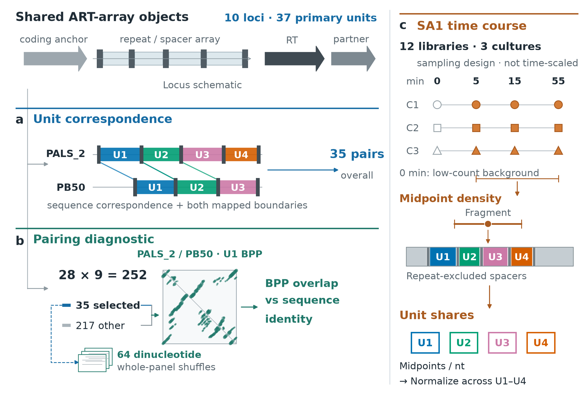

# ART-array analysis

This repository contains analysis code, saved data products, public-source provenance, equation definitions, and figure sources for a study of array-associated reverse transcriptase (ART) loci in *Staphylococcus* phages. It supports three bounded questions:

1. Where does unit-level sequence correspondence persist between a seven-locus reference group and three PB50-related loci?
2. How strongly does predicted spacer-pairing overlap track sequence identity among the compared units?
3. How are four operational units at the SA1 locus represented across a public infection time course?



Figure 1 shows the repository architecture: one fixed set of 37 primary units feeds the correspondence and predicted-pairing analyses, while the SA1 coordinate system feeds the public RNA-seq analysis. The workflow keeps comparative sequence analysis, predicted-RNA analysis, and SA1 RNA-seq composition as separate evidence streams. Operational units and folding intervals are analysis objects; they are not claims about mature RNA ends or biochemical function. The repository does not include a manuscript or make the lightweight saved-table route equivalent to raw-data reconstruction.

## Main results represented in the repository

- The fixed ten-locus annotation contains 47 primary periodic-chain copies and 37 primary units. A position-blind reciprocal sequence match plus two-boundary agreement supported 35 nonredundant cross-group unit pairs across 18 of 21 locus pairs, concentrated at distal U1 and U2.
- The observed 35 supported pairs exceeded every one of 64 whole-panel block-shuffled results (range 4–14). This calibration is conditional on the fixed annotation and does not validate array discovery.
- The descriptive Table 1 component comparison retained 61 pairs under unique reciprocal sequence matching alone, 40 with the left-boundary component, 48 with the right-boundary component, and 35 with both boundary components. This is not a truth, accuracy, sensitivity, or superiority benchmark.
- Across all 252 cross-group unit combinations, predicted spacer-pairing overlap increased with sequence identity. Exploratory shared-range comparisons did not show a consistent supported-pair advantage beyond that relationship.
- In twelve public SA1 RNA-seq libraries from three repeatedly sampled cultures, U3 remained dominant at 5, 15, and 55 minutes. U1 and U2 increased and U3 decreased from 5 to 55 minutes in all three cultures, but no unit met the culture-paired change rule: every involved library had to be estimable at 100 or more sense midpoint fragments, the three paired changes had to share one nonzero direction, and their median absolute magnitude had to be at least five percentage points.

These results do not test conservation–expression coupling, establish mature RNA products, or assign ART function.

## Quick offline reproduction

Use Python 3.12 and create an isolated environment from the repository root:

```bash
python -m venv .venv
# Windows PowerShell: .venv\Scripts\Activate.ps1
# POSIX shell: source .venv/bin/activate
python -m pip install --upgrade pip
python -m pip install -r requirements.txt
python scripts/reproduce.py --output results/reproduced
```

The command reads the supplied saved tables, recomputes the key reported summaries and Table 1 rule comparison, and regenerates all 11 article figures beneath `results/reproduced/`. It is offline: it does not download public records or FASTQ files, run Bowtie2 or fastp, rerun ViennaRNA folding, or regenerate either 64-panel calibration from its original sequence objects. The lightweight environment pins Matplotlib 3.10.6. The accepted Figure 1 reference export records Matplotlib 3.11.2; the accepted Figure 2–9 and Figure S1–S2 data-figure exports retain their earlier Matplotlib 2.2.3 provenance. The command checks semantic outputs and file structure, but does not claim pixel-identical rendering across those environments.

The reference figure exports are under [`figures/reference/`](figures/reference/). Freshly generated files under `results/reproduced/` are separate outputs and do not overwrite those references. See [`docs/reproducibility.md`](docs/reproducibility.md) for the supported modes, dependencies, component-level commands, and the limits of the raw-data route. [`docs/figure_map.tsv`](docs/figure_map.tsv) maps every main and supplementary figure, plus the key supplementary tables, to its inputs, command, and output.

## Full public RNA-seq route

The repository supplies the combined phage-host FASTA and frozen ENA run metadata. After installing aria2 1.37.0, fastp 1.3.3, and Bowtie2 2.5.5 or making compatible commands available on `PATH`, build the index and run the twelve libraries sequentially:

```bash
python scripts/p6_rnaseq/build_bowtie2_index.py --threads 8
python scripts/p6_rnaseq/orchestrate_complete_runs.py --threads 8 --force
python scripts/p6_rnaseq/aggregate_complete_runs.py
```

The repository includes complete saved statuses for all twelve libraries. Without `--force`, the orchestrator deliberately reuses those outputs, prints each skipped run, and reports processed/skipped counts; it does not download or reprocess those libraries. Use `--force` in a disposable clone or copy to download the 24 FASTQ files named in the saved ENA metadata, verify sizes and MD5 values, and reprocess all twelve libraries. `--stop-after-first-library` provides an optional user-controlled early stop. A normal resume processes only runs not marked complete. After a forced first-library check against this bundled snapshot, continue a full rerun with `--force` and without `--stop-after-first-library`; that command repeats the first library and then runs the other eleven. Tool paths can be supplied by command-line options or environment variables; the full setup and recorded resource evidence are in [`docs/reproducibility.md`](docs/reproducibility.md).

The public per-library runner is a portable adaptation of the saved Windows workflow: it replaces the original `findstr` SAM prefilter with an inline exact RNAME match. The bundled per-library receipts were produced by the original `findstr` workflow. This portable adaptation has not been exercised in a fresh full raw-data run, so strict equivalence is not claimed. A fresh raw-data end-to-end run is also not implied by the lightweight reproduction command.

## Repository layout

```text
data/
  README.md           data scope, provenance, and reuse guide
  MANIFEST.tsv        file-level data inventory
  sources.tsv         loci, host, BioProject, and publication sources
  rnaseq_libraries.tsv
                       twelve runs and 24 source FASTQ URLs
  processed/          saved analysis objects, diagnostics, and final tables
  raw/                selected public genome/protein records and bounded query returns
  source_metadata/    accessions, retrieval metadata, and runtime receipts
docs/                  workflow diagram, reproducibility guide, and output map
figures/reference/     fixed Figure 1–9 and Figure S1–S2 exports
scripts/
  reproduce.py         lightweight offline reproduction entry point
  p2_analysis/         ten-locus annotation and correspondence analysis
  p3_calibration/      64-panel spacer-order calibration
  p6_rna/              ensemble-pairing analysis and calibration
  p6_protein/          fixed-set protein analysis and bounded source screening
  p6_rnaseq/           SA1 read-processing and saved-table aggregation
  p6_revision_20260925/diagnostics/
                         saved-table identity, temporal, and coverage diagnostics
  p6_revision_20260925_r6/figures/
                         accepted data-figure renderers (historical numbering)
  p6_revision_20260926_r8/
                         current numbering wrapper, Figure 1, Table 1, and equations
```

The dated script and data directory names are stable provenance identifiers.

## Public data sources

The ten versioned phage genome records are MW218148.1, MW248466.1, MW349129.1, OR836606.1, LC680885.1, MN091626.1, MZ779063.1, OR455461.1, MW349128.1, and OR770614.1. The infection time course is [ENA BioProject PRJNA836150](https://www.ebi.ac.uk/ena/browser/view/PRJNA836150), and the joint alignment reference also uses host RefSeq [NZ_CP059679.1](https://www.ncbi.nlm.nih.gov/nuccore/NZ_CP059679.1). [`data/sources.tsv`](data/sources.tsv) records these sources and the two source publications; [`data/rnaseq_libraries.tsv`](data/rnaseq_libraries.tsv) records the twelve runs and 24 HTTPS FASTQ locations. Raw FASTQ and SRA files are not redistributed here. See [`data/README.md`](data/README.md) and [`data/MANIFEST.tsv`](data/MANIFEST.tsv) for scope and file-level provenance.

The ART system and the original SA1 locus-level transcription observations were described in:

- Yoon PH, Athukoralage JS, Ameisen E, Kauderer-Abrams E, Perry NT, Durrant MG. *Autonomous AI agents discover reverse transcriptases with tandem repeat arrays*. Anthropic technical preprint, 2026. [Official release](https://www.anthropic.com/news/claude-discovers-novel-enzyme-system) and [preprint PDF](https://www-cdn.anthropic.com/22573675ada52a8ca8a97a1a4b4326b2f208a071.pdf).
- Zhang B, Xu J, He X, Tong Y, Ren H. Interactions between Jumbo Phage SA1 and Staphylococcus: A Global Transcriptomic Analysis. *Microorganisms*. 2022;10(8):1590. [doi:10.3390/microorganisms10081590](https://doi.org/10.3390/microorganisms10081590).

Additional biological and software references are retained in the parameter records and source metadata. Retrieval scripts contact changing public services; their future returns may differ from the saved records.

## Citation

[`CITATION.cff`](CITATION.cff) describes version 1.1.0 as software and unpublished research material. Please also cite the relevant source studies, sequence records, and BioProject when using those materials. The [v1.1.0 release page](https://github.com/zhangyue616/art-array-analysis/releases/tag/v1.1.0) is the stable entry point for this revision; external archival identifiers, when available, are recorded there. The [v1.0.0 release](https://github.com/zhangyue616/art-array-analysis/releases/tag/v1.0.0) remains the historical ten-figure snapshot with the earlier main-figure numbering.

## License and reuse

Repository-authored code and documentation are released under the [MIT License](LICENSE). Original derived tables, summary matrices, figures, and the workflow illustration are released under [CC BY 4.0](LICENSE-DATA.md). Public database records, source metadata, and other third-party materials retain their original rights and terms and are not relicensed here; see [THIRD_PARTY_NOTICES.md](THIRD_PARTY_NOTICES.md). The repository-authored code has no additional restriction on nonacademic use, but users remain responsible for the terms of external data and software.
